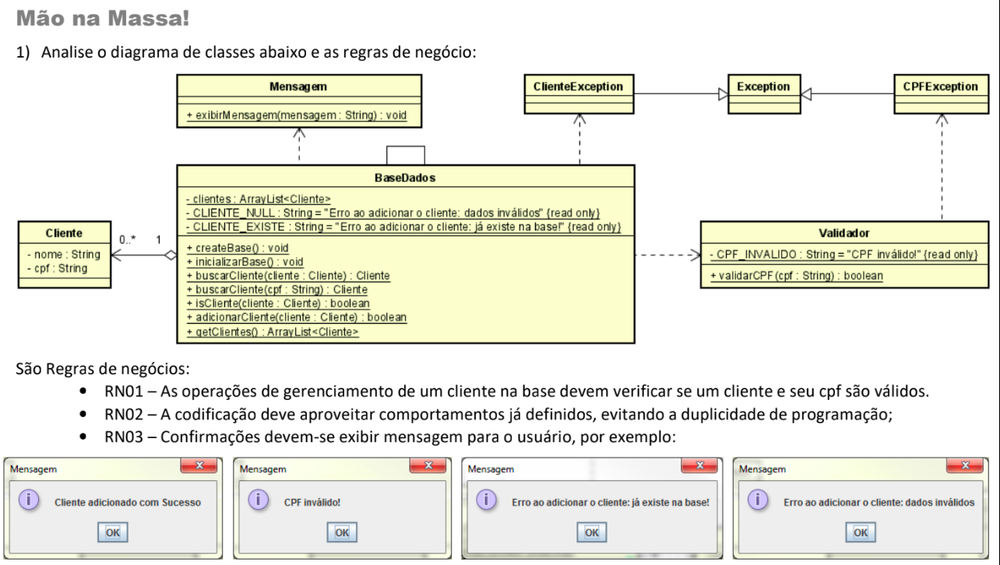

# Lista XI MPOO

## Objetivo
Foram vistos em sala conceitos de Manipulação de Exceções, esse código fiz para mim mesmo praticar
resolvi colocar ele no meu GitHub para ajudar aqueles que estão com dificuldade na matéria ou apenas 
interessados no assunto espero ajudar a todos de alguma forma.

## Problema


## Como eu resolvi?
Comecei criando as classes independentes como Cliente, Mensagem, Validador (já possuia o código pronto do professor)
e logo após parti para a BaseDados, toda dúvida que eu tive durante o projeto e mensagens de erro fui pesquisando no
google em inglês também indicaria o uso do chatGPT para entender problemas e não códigos prontos mas não utilizei o mesmo.

## Contato
Qualquer dúvida podem entrar em contato:
```Email: luiz.guilhermemelo@ufrpe.br```
